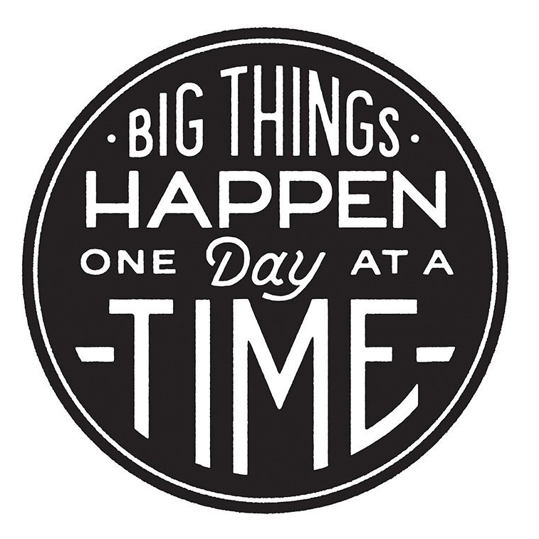

# Time & Project Management

## _Time Management_

**It is imperative that you keep an analog or digital calendar. I actually keep both.**

\_\_

## _Project Management_

## _Recommended Planners and Journals_

_The most highly recommended planner or journal by students is the_ [**Bullet Journal**](https://bulletjournal.com/)**.** It's a system. You only need to use a pen and paper or digital tablet to engage. In other words, there's no journal to buy.

I personally use an un-dated digital version of the ink and volt planner. I've gone back and forth between several of these. Planners and journals are personal. You have to figure out what works for you, and as you grow your planner and journal needs may change. 

**Planners**

* [Ink and Volt Planner](https://inkandvolt.com/product/volt-planner/) _\(physical or digital; I use the digital version of this one on a digital tablet.\)_
* [Gettoworkbook.com](https://www.gettoworkbook.com/photos) 
* [Unbound Planner](https://unboundplanner.com/collections/frontpage) _\(physical and digital\)_
* [The Productivity Planner](https://www.intelligentchange.com/products/the-productivity-planner)

**Journals**

* **\***[**Bullet Journal**](https://bulletjournal.com/) ****
* [Best Self Journal](https://bestself.co/products/self-journal) \([Download PDF Sample](http://teaching.polishedsolid.com/time-warrior/selfjournal.pdf)\)
* [Five Minute Journ](https://www.intelligentchange.com/products/the-five-minute-journal)

## Track Your Actionable Tasks and Progress

Regardless of what you choose, you need to create a system to track your actionable tasks and progress \(aka making sure you are getting your project tasks done\).

**Break down** EVERYTHING you need to do for **your project into actionable tasks.** One method is [Personal Kanban](http://personalkanban.com/pk/personal-kanban-101/), but you may have your own.  
  
All actionable tasks should start with a verb \(i.e. write, call, email, build, collect, etc.\) and be visible in some way \(not in your head\).

I recommend using an analog, digital, or analog/digital combination.

* post-it notes on a wall or mini ones in a notebook \(so you can move them around\),
* [bullet journal](https://bulletjournal.com/) \(many students use this method\) or
* a digital representation of your milestones using [kanbanery.com](http://kanbanery.com) or another digital platform of your choice.

The columns I recommend for Personal Kanban \(but you are not limited to\) are:

* To-Do \(I recommend keeping a monthly and weekly one.\)
* Today \(Work-In-Progress \(WIP\) limit of 3 to 5 maximum\)
* Waiting For \(OPTIONAL\)
* Done

If you use Kanbanery.com, please go to **Settings**, and under **General Settings** **enable** a _public URL_ and make sure you press **Update** at the bottom of the General Settings page. Then, copy and paste your public URL to slack as a comment to the specific kanbanery.com message.

