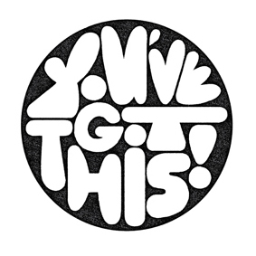

# IDM Showcase

 **May 11, 2020, Exact Time TBD** 

Participation is MANDATORY for the end of semester showcase!!

At a minimum providing us with the following materials by the end of the month:

1\) A one minute video that explains their project   
2\) a URL to view the project \(can be a video link, documentation, live site, etc\)   
3\) an image that represents the project \(can be of the thing itself, a graphic treatment, etc\)   
4\) text describing the project   
5\) project title

Students may also submit additional media- images, videos- as appropriate.

**Specific details on how to submit this will be sent directly to the students the week of April 5.** We know that many of the projects will not be fully completed before the end of the semester which is why we are asking for a static URL to view the completed work. All the other materials need to be completed by the submission date - they would be able to work on the content of the site up until the day of the show itself.  
  
We are also going to ask senior project students to participate in live discussions about their work on May 11. Last semester this was a great way for them to publicly talk about their process and prototypes for a wider audience. We encourage students to invite friends, family, and colleagues to watch these discussions. Last year, we had over 2000 viewers over the course of the day. 

Your senior project will be publicly shown in the IDM showcase at the end of the semester \(date to be determined\). Exhibiting your work is truly a gift of accomplishment, response, and feedback.

* **Show Your Work:** Your project should be as complete as humanly possible. You will exhibit your senior project publicly in the IDM Showcase. If you don't understand the importance and benefits of exhibiting your work, I HIGHLY recommend that you read [Show Your Work!](http://www.amazon.com/Show-Your-Work-Creativity-Discovered-ebook/dp/B00GU2RGGI/ref=sr_1_1?ie=UTF8&qid=1420589663&sr=8-1&keywords=show+the+work+austin+kleon) by Austin Kleon NOW \([Cheat Sheet](https://i.gr-assets.com/images/S/compressed.photo.goodreads.com/hostedimages/1384352860i/6856374._SY540_.jpg)\).
* **Document Your Feedback!**

