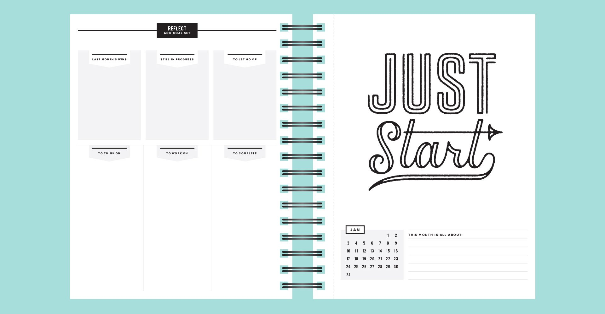
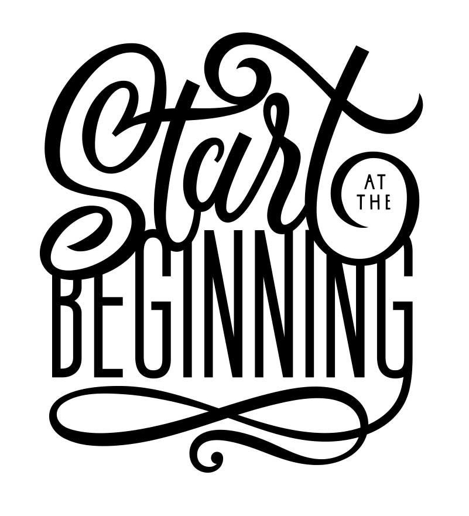

# Pre-work - THIS IS A DRAFT! NOT FINAL!

> John Cage tells us that not knowing where to begin is a common form of paralysis. His advice: begin anywhere. ~[Bruce Mau's Manifesto](https://www.massivechangenetwork.com/bruce-mau-manifesto).

[Join our slack channel](https://idmspsp2021.slack.com/) with your nyu.edu email address.

* Read the [syllabus](../syllabus.md) and be prepared to discuss and ask questions on first day of class.  
* Please direct message deangela on slack if you find any broken links or typos in the syllabus.
* Populate a calendar \(google, iCal, or non-digital\) with due dates for this class, even though dates may change.
* Create a google drive folder labeled "Senior Project SP21 your first and last name" and share with deangela.duff@nyu.edu \(i.e. Senior Project SP21 De Angela Duff\).
* Set up [dedicated process website](website.md) for senior project.
* Please add your name and the URL of your process website to this [shared google doc](https://docs.google.com/document/d/1Y3DCwp7kZoMx-zMVO6IMVDuD9AUpfTLV2gx7sPXTd7U/edit).
* Before beginning to prep for your [pecha kucha presentation](pecha_kucha.md), read the following chapters in _Do The Work_ by Steven Pressfield. \(There is a link to a pdf version in our slack channel.\) 
  * About this Book preface
  * Orientation: Enemies & Allies
  * Beginning
* AFTER reading the preface and the first two chapters in _Do The Work_:
  * Write a [response](../assignments/responses.md) that also contains a list of your enemies and allies and upload to a folder labeled "Pre-work" in your project documentation folder for your [end of semester deliverables](../end_of_semester_deliverables/). You do not have to post this to the process website so that only you and I can read your response.
* Listen to the first [watchmen tv series podcast](https://www.hbo.com/watchmen/watchmen-listen-to-official-podcast), Masks, for episodes 1-3 \(57 min\) to hear about writer Damon Lindelof's process. The point of listening is NOT to learn about the watchmen but to understand his creative process in developing the tv series and how his team went about researching and making creative decisions. You don't need to watch the series because again you're not listening to this to learn about watchmen. I want you to hear how Lindelof's "inputs" \(remember ideation & prototyping\) help him create.
  * AFTER listening to the podcast, write a [response](../assignments/responses.md) which includes the identification of _at least_ 3 "inputs" for Lindelof in creating watchmen, NOT including the original graphic novel, as well as the identification of _at least_ 3 "inputs" \(aka research diet\) for your senior project. Post your response to your [process website](website.md) and post a link to your response on this [google doc](https://docs.google.com/document/d/1wHaH_ytbwvz8WO1-h-0mByGPXTLDCKLRHbA8N-UfVBc/edit?usp=sharing). 
* \(OPTIONAL\) Before beginning to prep for your [pecha kucha presentation](pecha_kucha.md) If you need help coming up with ideas for your senior project, do one or more of the following brainstorming exercises and document \(i.e. Take photos and/or screenshots OR write a [response](../assignments/responses.md) depending on which is applicable\), post to your [process website](website.md), and upload to a folder labeled "Pre-work" in your project documentation folder for your [end of semester deliverables](../end_of_semester_deliverables/).
  * [Free Writing, Word Lists & Mind Maps](../brainstorming/free-writing-word-lists-and-mind-maps.md)
  * [SCAMPER Technique](http://www.mindtools.com/pages/article/newCT_02.htm)
  * [Card Sorting Technique](../brainstorming/card_sorting.md)
  * [Storytelling Exercise](../brainstorming/storytelling_exercise.md)
  * Read or watch one or more of the [recommended resources](../recommended_resources.md) under "creativity" or "audio podcasts"
  * Browse one or more of the "inspiration" links in [recommended resources](../recommended_resources.md)
* Prepare [pecha kucha presentation](pecha_kucha.md) to present on the 1st day of class.

