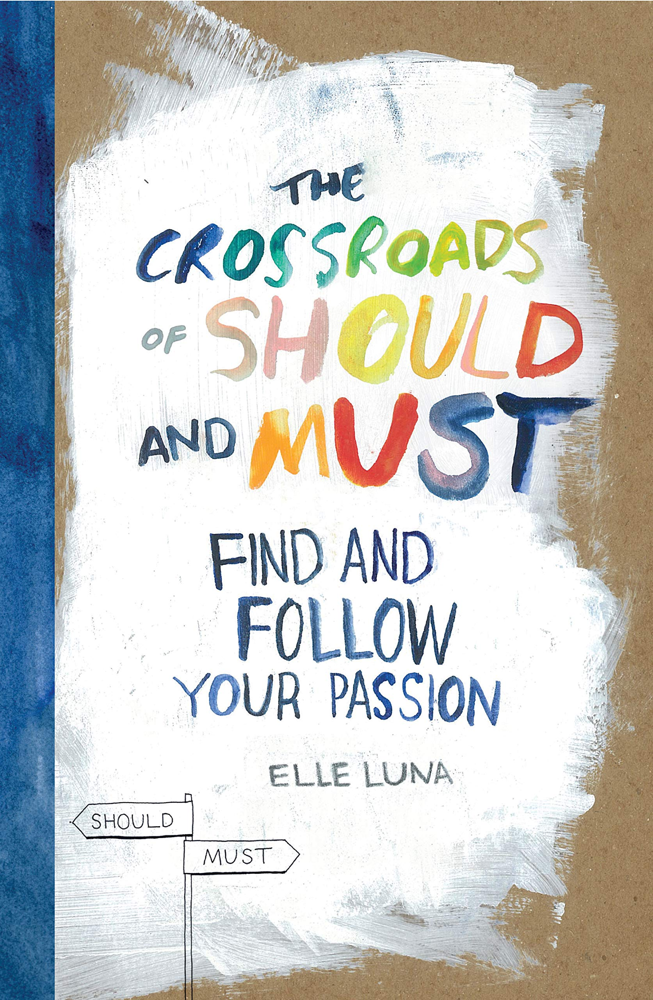
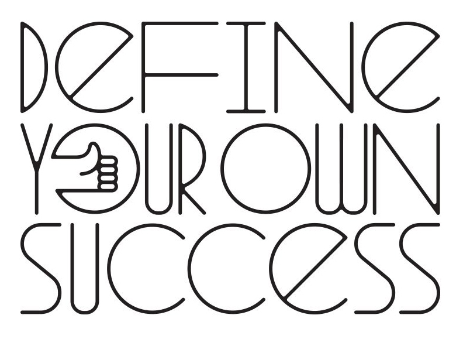

# Career Preparation Resources

## NYU Resources

* [NYU IDM Job Postings on LinkedIn](https://www.linkedin.com/groups/8684560/)
* [NYU Global Awards](http://nyu.edu/scholarships) \(Fulbright, Marshall, Rhodes, etc.\). Remember your contact is Kristofor Larsen, kristofor.larsen@nyu.edu.
* [NYU Photo Bureau](https://www.nyu.edu/about/leadership-university-administration/office-of-the-president/university-relationsandpublicaffairs/public-affairs/photo-bureau.html)

  **Students** can get free headshots from the NYU Photo Bureau. I highly recommend that you take advantage of it for your portfolio website and LinkedIn profile. It's a very popular service. You just need to book it \(sometimes weeks\) in advance. The NYU photo bureau is currently moving locations. So they're not taking any appointments until February.

* [NYU Wasserman Center](https://www.nyu.edu/students/student-information-and-resources/career-development-and-jobs.html) for Career Development
* [NYU Leslie Elab](https://entrepreneur.nyu.edu/) \(Entrepreneurship\)

## Catt Small \(IDM Alumna\)

* \*\*\*\*[**Impress for success: Strategic ways to seem more hireable**](https://cattsmall.com/advice/2018/09/24/be-hireable-get-hired.html)\*\*\*\*
* \*\*\*\*[**12 tips for getting into a new career**](https://cattsmall.com/advice/2019/11/02/get-entry-level-job-new-career.html)\*\*\*\*

## LinkedIn

* LinkedIn Learning:
  * [Designing a Resumé for Creatives](https://www.linkedin.com/learning/designing-a-resume-for-creatives/welcome?u=2131553)
* LinkedIn Help: 
  * [Let Recruiters Know You’re Open to Job Opportunities \| LinkedIn Help](https://www.linkedin.com/help/linkedin/answer/67405?lang=en&src=aff-lilpar&veh=aff_src.aff-lilpar_c.partners_pkw.123201_plc.adgoal%20GmbH_pcrid.449670_learning&trk=aff_src.aff-lilpar_c.partners_pkw.123201_plc.adgoal%20GmbH_pcrid.449670_learning&clickid=XVGx8mzlPxyOUGjwUx0Mo38SUki2%3A00lwW9ZVM0&irgwc=1)
  * [Find Jobs on LinkedIn – Best Practices \| LinkedIn Help](https://www.linkedin.com/help/linkedin/answer/110912)

## AIGA \(Professional Org for Creatives\)

* [AIGA's Career Advice during COVID-19](https://www.aiga.org/aiga/content/tools-and-resources/commitment-to-community/career-advice-for-covid-19/).
* [AIGA's Internships in Design: Advice for COVID-19](https://www.aiga.org/aiga/content/tools-and-resources/commitment-to-community/internships-in-design-advice-for-covid-19/).
* [AIGA's How To Ace the Virtual Interview](https://www.aiga.org/aiga/content/tools-and-resources/commitment-to-community/how-to-ace-the-virtual-interview/).

## Job Boards

* [Glass Door](http://glassdoor.com)
* **Highly Recommended!** Subscribe to the [Words of Mouth Newsletter](http://www.wordsofmouth.org/)
* [Uncubed](https://uncubed.com)
* [We Work Remotely](https://weworkremotely.com)
* [AIGA Design Jobs](http://designjobs.aiga.org)
* [Creative Applications](http://www.creativeapplications.net/job-board)
* [Krop](http://www.krop.com)
* [Coroflot](http://www.coroflot.com/public/jobs_browse.asp)
* [Creative Hotlist](http://www.creativehotlist.com)\_\_

## **Miscellaneous**

* [AIGA Professional Resources](http://www.aiga.org/professional-resources)
* [Pew Research](http://www.pewresearch.org/)
* [Get A Design Job!](http://www.aiga.org/get-a-design-job) by RitaSue Siegel
* [How to Be a Graphic Designer without Losing Your Soul](https://www.amazon.com/Graphic-Designer-without-Losing-Expanded/dp/1568989830/ref=tmm_pap_swatch_0?_encoding=UTF8&qid=1516586778&sr=1-1-spell) by Adrian Shaughnessy

## Salary Negotiation

* [Fearless Negotiating](https://www.amazon.com/Fearless-Negotiating-Michael-C-Donaldson/dp/1259584801/ref=sr_1_1_twi_pap_2?ie=UTF8&qid=1516674344&sr=8-1&keywords=fearless+negotiating) by Michael C. Donaldson
* [Lean In for Graduates](http://www.amazon.com/Lean-Graduates-Sheryl-Sandberg/dp/0385353677/ref=sr_1_1?ie=UTF8&qid=1442940600&sr=8-1&keywords=lean+in+for+graduates) by Sheryl Sanders
* [Influence: The Psychology of Persuasion](https://www.amazon.com/Influence-Psychology-Persuasion-Robert-Cialdini/dp/006124189X/ref=sr_1_4?s=books&ie=UTF8&qid=1516674402&sr=1-4&keywords=influence) by Robert B. Cialdini
* [How To Win Friends & Influence People](https://www.amazon.com/How-Win-Friends-Influence-People-ebook/dp/B003WEAI4E/ref=sr_1_3?s=books&ie=UTF8&qid=1516674757&sr=1-3&keywords=dale+carnegie) by Dale Carnegie

  \_\_

## Freelance

* [The Business Side of Creativity: The Complete Guide to Running a Small Graphics Design or Communications Business](https://www.amazon.com/Business-Side-Creativity-Comprehensive-Communications/dp/0393734005/ref=la_B00IMVP96O_1_1?s=books&ie=UTF8&qid=1516586595&sr=1-1) by Cameron Foote
* [Docracy](http://www.docracy.com/doc/showalluserdocs?sortBy=4&page=1&userId=7435)
  * [**Andy Clarke's Contract Killer 3**](http://stuffandnonsense.co.uk/projects/contract-killer)
  * [Development Service Contract](https://www.docracy.com/7079/development-service-contract)
* [AIGA Standard Service Agreement](http://www.aiga.org/standard-agreement/)
* [smashing magazine: The Collective Legal Guide for Designers](http://www.smashingmagazine.com/2013/04/03/legal-guide-contract-samples-for-designers/)
* [Dealing with Clients who refuse to pay](http://www.smashingmagazine.com/2010/04/09/dealing-with-clients-who-refuse-to-pay)
* [Free Agent Nation: The Future of Working for Yourself](https://www.amazon.com/Free-Agent-Nation-Working-Yourself/dp/0446678791/ref=asap_bc?ie=UTF8) by Daniel Pink.

## Entrepreneurship

* [The E-Myth Revisited](https://www.amazon.com/E-Myth-Revisited-Small-Businesses-About/dp/0887307280/ref=tmm_pap_swatch_0?_encoding=UTF8&qid=1516833277&sr=8-1) by Michael Gerber
* [Rework](https://www.amazon.com/Rework-Jason-Fried/dp/0307463745/ref=sr_1_1_twi_har_2?s=books&ie=UTF8&qid=1516586631&sr=1-1&keywords=rework) by Jason Fried and David Heinemeier Hansson.

  _Networking_

* [Never Eat Alone](https://www.amazon.com/Never-Eat-Alone-Expanded-Updated/dp/B00H6JBFOS/ref=sr_1_1?s=books&ie=UTF8&qid=1516833304&sr=1-1&keywords=never+eat+alone) by Keith Ferrazzi

  _Branding_

* [Zag: The Number One Strategy of High-Performance Brands](https://www.amazon.com/Zag-Number-Strategy-High-Performance-Brands/dp/0321426770/ref=sr_1_3?ie=UTF8&qid=1516833998&sr=8-3&keywords=marty+neumeier) by Marty Neumeier

## Lifestyle Design

* [The 4-Hour Workweek, Expanded and Updated](http://www.amazon.com/4-Hour-Workweek-Expanded-Updated-Cutting-Edge/dp/0307465357/ref=sr_1_2?s=books&ie=UTF8&qid=1312561321&sr=1-2) by Timothy Ferriss
* [Anything You Want](http://www.amazon.com/Anything-You-Want-Derek-Sivers/dp/1936719118/ref=sr_1_1?s=books&ie=UTF8&qid=1312561032&sr=1-1) by Derek Sivers
* [How To Stop Worrying & Start Living](https://www.amazon.com/How-stop-worrying-start-living-ebook/dp/B01NCV2RIR/) by Dale Carnegie
* [The Art of Non-Conformity: Set Your Own Rules, Live the Life You Want, and Change the World](http://www.amazon.com/Art-Non-Conformity-Rules-Change-World/dp/0399536108/ref=sr_1_1?s=books&ie=UTF8&qid=1312561247&sr=1-1) by Chris Guillebeau

## _Crowdsource Funding_

* [Kickstarter](http://kickstarter.com)
* [Indiegogo](http://www.indiegogo.com)
* [PledgeMusic](http://pledgemusic.com)
* [GoFundMe](http://gofundme.com)

## Recommended Audio Podcasts

* [Revision Path](https://itunes.apple.com/us/podcast/revision-path/id834173190?mt=2) 
  * Maurice Cherry interviews designers, developers, and other creators of color weekly.
* [The Tim Ferriss Show](https://itunes.apple.com/us/podcast/the-tim-ferriss-show/id863897795?mt=2) 
  * Tim Ferriss deconstructs world-class performers from eclectic areas \(investing, sports, business, art, etc.\) to extract the tactics, tools, and routines you can use. This includes favorite books, morning routines, exercise habits, time-management tricks, and much more.
  * I suggest listening to Derek Sivers, Debbie Millman, and David Heinemeier Hansson
* [Unmistakeable Creative](https://itunes.apple.com/us/podcast/unmistakable-creative/id352721366?mt=2) 
  * Srini Rao interviews instigators, rebels, and people with a pathological inability to accept the status quo.
* [How I Built This](https://www.npr.org/podcasts/510313/how-i-built-this)
* [State of the Art](https://itunes.apple.com/us/podcast/state-of-the-art/id1305467447?mt=2)
* [Creative Class](https://creativeclass.co/podcast/) 
  * A podcast for freelancers
* [StartUp Podcast](https://itunes.apple.com/us/podcast/startup-podcast/id913805339?mt=2) 
  * StartUp is a podcast series about what it’s really like to get a business off the ground.
  * In Season 1, Alex Blumberg told the story of launching this business, Gimlet Media, a podcast network.
  * In Season 2, Lisa Chow joined Alex to follow an entirely new company: a company called Dating Ring, founded by two women in their 20s, outsiders in the male-dominated world of Silicon Valley.
  * In Season 3, rather than following one company over many episodes, they are telling stories about many companies that all have something in common: their companies are stuck, and they know they need to make a big change.

## Creativity

* [Everything is a remix](https://www.everythingisaremix.info/watch-the-series) by Kirby Ferguson
* [Keep Going: 10 Ways to Stay Creative in Good Times and Bad](https://www.amazon.com/Keep-Going-Ways-Creative-Times/dp/1523506644/ref=sr_1_1?keywords=austin+kleon&qid=1578346637&sr=8-1) by Austin Kleon \([Cheat Sheet](https://miro.medium.com/max/2048/1*Sz1lQkqKnhcWjcmy4xaxNA.jpeg)\)
* [Steal Like An Artist: 10 Things Nobody Told You About Being Creative](http://www.amazon.com/Steal-Like-Artist-Things-Creative/dp/0761169253/ref=sr_1_1?ie=UTF8&qid=1422468736&sr=8-1&keywords=steal+like+an+artist) by Austin Kleon \([Cheat Sheet](https://bbinno.files.wordpress.com/2016/04/steal2.png?w=736)\)
* [The Rise: Creativity, the Gift of Failure, and the Search for Mastery](https://www.amazon.com/Rise-Creativity-Failure-Search-Mastery/dp/1451629249/ref=sr_1_1?keywords=sarah+lewis&qid=1578348223&sr=8-1) by Sarah Lewis
* [The War of Art: Break Through the Blocks and Win Your Inner Creative Battles](http://www.amazon.com/War-Art-Through-Creative-Battles/dp/0446691437/) by Steven Pressfield Read the required book _Do The Work_ also by Steven Pressfield first \(see the syllabus\).
  * If you like _Do The Work_ and want to read more about what he talks about, I highly suggest that you acquire this one as well. _Do The Work_ is pretty much a distillation of the principles in _The War of Art_. 

## Design

* [Graphic Design: The New Basics](https://www.amazon.com/Graphic-Design-Basics-Revised-Expanded/dp/161689332X/ref=tmm_pap_swatch_0?_encoding=UTF8&qid=1516898876&sr=8-1) by Ellen Lupton
* [Thinking with Type](http://thinkingwithtype.com/)
* [Lessons in Typography](https://www.amazon.com/Lessons-Typography-Must-know-typographic-principles/dp/0133993558/ref=tmm_pap_swatch_0?_encoding=UTF8&qid=1516898915&sr=1-1) by Jim Krause

## Exhibition & Promotion

* [Show Your Work!: 10 Ways to Share Your Creativity and Get Discovered ](http://www.amazon.com/Show-Your-Work-Creativity-Discovered/dp/076117897X/ref=sr_1_1?ie=UTF8&qid=1440022873&sr=8-1&keywords=show+your+work) by Austin Kleon

## Fair Use Assets

* [http://creativecommons.org](http://creativecommons.org)
* [https://www.pond5.com](https://www.pond5.com/)

_Royalty-Free sound_

* [http://freesound.org](http://freesound.org)
* [http://freemusicarchive.org](http://freemusicarchive.org)
* [http://ccmixter.org](http://ccmixter.org)
* [http://soundbible.com](http://soundbible.com)
* [http://www.audioblocks.com](http://www.audioblocks.com)
* [http://incompetech.com](http://incompetech.com)

_Creative Commons Video_

* [http://archive.org](http://archive.org)

## Inspiration

* [Brain Pickings](https://www.brainpickings.org/)
* [Creative Applications](http://www.creativeapplications.net/)
* [Creators Project](https://creators.vice.com/en_us)
* [Eyeo Talks](https://vimeo.com/eyeofestival)
* [Kickstarter](https://www.kickstarter.com/)
* [Rhizome](http://rhizome.org/)
* [TED Talks](https://www.ted.com/)
* [The Creative Independent](https://thecreativeindependent.com/)
* [We Make Money Not Art](http://we-make-money-not-art.com/)

## Presentation

* [Speaking.io](http://speaking.io)
* [Advice on Public Speaking from Zach Lieberman](https://medium.com/@zachlieberman/advice-on-public-talks-a984876388c2)
* [Jer Thorp, Three things I’ve learned from 18 years of public speaking](https://medium.com/@blprnt/the-three-things-i-learned-from-eighteen-years-of-public-speaking-875f01178902) 

## 

## Writing

* [Copywriting: Successful Writing for Design, Advertising and Marketing](https://www.amazon.com/Copywriting-Successful-Writing-Advertising-Marketing/dp/1780670001/ref=sr_1_5?s=books&ie=UTF8&qid=1516899375&sr=1-5&keywords=copywriting) by Mark Shaw
* [The Elements of Style, Fourth Edition](http://www.amazon.com/Elements-Style-Fourth-William-Strunk/dp/020530902X/ref=sr_1_1?ie=UTF8&qid=1422276317&sr=8-1&keywords=stunk+and+whites+elements+of+style) by Strunk and White
* [The Mac is Not a Typewriter](http://www.amazon.com/Mac-Not-Typewriter-2nd/dp/0201782634/ref=sr_1_1?ie=UTF8&qid=1422276493&sr=8-1&keywords=the+mac+is+not+a+typewriter) by Robin Williams

\_\_

_Miscellaneous_

* [AIGA Professional Resources](http://www.aiga.org/professional-resources)
* [Pew Research](http://www.pewresearch.org/)
* [Get A Design Job!](http://www.aiga.org/get-a-design-job) by RitaSue Siegel
* [How to Be a Graphic Designer without Losing Your Soul](https://www.amazon.com/Graphic-Designer-without-Losing-Expanded/dp/1568989830/ref=tmm_pap_swatch_0?_encoding=UTF8&qid=1516586778&sr=1-1-spell) by Adrian Shaughnessy 

_Job Boards_

* [Glass Door](http://glassdoor.com)
* **Highly Recommended!** Subscribe to the [Words of Mouth Newsletter](http://www.wordsofmouth.org/)
* [Uncubed](https://uncubed.com)
* [We Work Remotely](https://weworkremotely.com) 
* [AIGA Design Jobs](http://designjobs.aiga.org)
* [Creative Applications](http://www.creativeapplications.net/job-board)
* [Krop](http://www.krop.com)
* [Coroflot](http://www.coroflot.com/public/jobs_browse.asp)
* [Creative Hotlist](http://www.creativehotlist.com)

_Salary Negotiation_

* [Fearless Negotiating](https://www.amazon.com/Fearless-Negotiating-Michael-C-Donaldson/dp/1259584801/ref=sr_1_1_twi_pap_2?ie=UTF8&qid=1516674344&sr=8-1&keywords=fearless+negotiating) by Michael C. Donaldson
* [Lean In for Graduates](http://www.amazon.com/Lean-Graduates-Sheryl-Sandberg/dp/0385353677/ref=sr_1_1?ie=UTF8&qid=1442940600&sr=8-1&keywords=lean+in+for+graduates) by Sheryl Sanders 
* [Influence: The Psychology of Persuasion](https://www.amazon.com/Influence-Psychology-Persuasion-Robert-Cialdini/dp/006124189X/ref=sr_1_4?s=books&ie=UTF8&qid=1516674402&sr=1-4&keywords=influence) by Robert B. Cialdini
* [How To Win Friends & Influence People](https://www.amazon.com/How-Win-Friends-Influence-People-ebook/dp/B003WEAI4E/ref=sr_1_3?s=books&ie=UTF8&qid=1516674757&sr=1-3&keywords=dale+carnegie) by Dale Carnegie

_Freelance_

* [The Business Side of Creativity: The Complete Guide to Running a Small Graphics Design or Communications Business](https://www.amazon.com/Business-Side-Creativity-Comprehensive-Communications/dp/0393734005/ref=la_B00IMVP96O_1_1?s=books&ie=UTF8&qid=1516586595&sr=1-1) by Cameron Foote 
* [Docracy](http://www.docracy.com/doc/showalluserdocs?sortBy=4&page=1&userId=7435)
  * [**Andy Clarke's Contract Killer 3**](http://stuffandnonsense.co.uk/projects/contract-killer)
  * [Development Service Contract](https://www.docracy.com/7079/development-service-contract)
* [AIGA Standard Service Agreement](http://www.aiga.org/standard-agreement/)
* [smashing magazine: The Collective Legal Guide for Designers](http://www.smashingmagazine.com/2013/04/03/legal-guide-contract-samples-for-designers/)
* [Dealing with Clients who refuse to pay](http://www.smashingmagazine.com/2010/04/09/dealing-with-clients-who-refuse-to-pay)
* [CSS Kill Switch](http://csskillswitch.com)
* [Free Agent Nation: The Future of Working for Yourself](https://www.amazon.com/Free-Agent-Nation-Working-Yourself/dp/0446678791/ref=asap_bc?ie=UTF8)by Daniel Pink 

_Entrepreneurship_

* [The E-Myth Revisited](https://www.amazon.com/E-Myth-Revisited-Small-Businesses-About/dp/0887307280/ref=tmm_pap_swatch_0?_encoding=UTF8&qid=1516833277&sr=8-1) by Michael Gerber
* [Rework](https://www.amazon.com/Rework-Jason-Fried/dp/0307463745/ref=sr_1_1_twi_har_2?s=books&ie=UTF8&qid=1516586631&sr=1-1&keywords=rework) by Jason Fried and David Heinemeier Hansson.

_Networking_

* [Never Eat Alone](https://www.amazon.com/Never-Eat-Alone-Expanded-Updated/dp/B00H6JBFOS/ref=sr_1_1?s=books&ie=UTF8&qid=1516833304&sr=1-1&keywords=never+eat+alone) by Keith Ferrazzi 

_Branding_

* [Zag: The Number One Strategy of High-Performance Brands](https://www.amazon.com/Zag-Number-Strategy-High-Performance-Brands/dp/0321426770/ref=sr_1_3?ie=UTF8&qid=1516833998&sr=8-3&keywords=marty+neumeier) by Marty Neumeier

_Crowdsource Funding_

* [Kickstarter](http://kickstarter.com)
* [Indiegogo](http://www.indiegogo.com)
* [PledgeMusic](http://pledgemusic.com)
* [GoFundMe](http://gofundme.com)

### 

