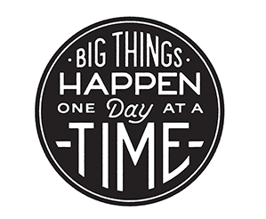

# Schedule

**ALL dates and assignments are subject to change at the discretion of the professor!** If applicable, means it depends on where you are in your process. Every project is different. Certain aspects of your project may take more or less time than others.

<table>
  <thead>
    <tr>
      <th style="text-align:left">wk1</th>
      <th style="text-align:left">date</th>
      <th style="text-align:left">class</th>
    </tr>
  </thead>
  <tbody>
    <tr>
      <td style="text-align:left">1</td>
      <td style="text-align:left"><a href="week1_detail.md">Mon Feb 01</a>
      </td>
      <td style="text-align:left">Pre-work due / Pecha kucha presentations</td>
    </tr>
    <tr>
      <td style="text-align:left">2</td>
      <td style="text-align:left"><a href="week2_detail.md">Mon Feb 08</a>
      </td>
      <td style="text-align:left">Individual One on Ones for ENTIRE class</td>
    </tr>
    <tr>
      <td style="text-align:left"></td>
      <td style="text-align:left">Wed Feb 10</td>
      <td style="text-align:left"><b>LAST DAY OF DROP/ADD</b> (to receive 100% of tuition &amp; fees and
        not receive a grade of &apos;W&apos;)</td>
    </tr>
    <tr>
      <td style="text-align:left"></td>
      <td style="text-align:left">Mon Feb 15</td>
      <td style="text-align:left"><b>President&apos;s Day / University Holiday / NO CLASS</b>
      </td>
    </tr>
    <tr>
      <td style="text-align:left">3</td>
      <td style="text-align:left"><a href="week3_detail.md">Thu Feb 18</a>
      </td>
      <td style="text-align:left">
        
<b>Legislative Day - Classes will meet according to a Monday schedule.</b>
        

        
Letters from Previous Cohort / Project Overview in Miro / Accountability
          Team Assignments

      </td>
    </tr>
    <tr>
      <td style="text-align:left">4</td>
      <td style="text-align:left"><a href="week4_detail.md">Mon Feb 22</a>
      </td>
      <td style="text-align:left">One on Ones for half of class / Accountability Teams in Airmeet. The other
        half of class will meet with me before or after class. Check slack for
        times.</td>
    </tr>
    <tr>
      <td style="text-align:left">5</td>
      <td style="text-align:left"><a href="week5_detail.md">Mon Mar 01</a>
      </td>
      <td style="text-align:left">Pro Practices Material Review (Cover Letter, Resume, and Portfolio, Career
        Research) / Tentative Guest: Lauren Blake (IDM 2020)</td>
    </tr>
    <tr>
      <td style="text-align:left">6</td>
      <td style="text-align:left">Mon Mar 08</td>
      <td style="text-align:left">Project Demos</td>
    </tr>
    <tr>
      <td style="text-align:left">7</td>
      <td style="text-align:left">Mon Mar 15</td>
      <td style="text-align:left">Project Demos</td>
    </tr>
    <tr>
      <td style="text-align:left">8</td>
      <td style="text-align:left">Mon Mar 22</td>
      <td style="text-align:left"><a href="../critiques-demos-presentations-and-exhibition/midterm-project-demo-instructions.md"><b>Midterm Demo and Critique</b></a>
      </td>
    </tr>
    <tr>
      <td style="text-align:left"></td>
      <td style="text-align:left">Tue Mar 23-Thu Mar 25</td>
      <td style="text-align:left">
        
<b>Midterm One On One Review for students who presented on Mon, March 22</b>
        

        <ul>
          <li>Will be conducted via Zoom</li>
          <li>Schedule 20 minutes ONLY at <a href="https://calendly.com/deangela">https://calendly.com/deangela</a>.</li>
          <li><a href="../end_of_semester_deliverables/midterm_self_assessment.md"><b>Midterm Self Assessment</b></a> (Direct
            message as pdf to deangela on slack BEFORE your meeting).</li>
        </ul>
      </td>
    </tr>
    <tr>
      <td style="text-align:left">9</td>
      <td style="text-align:left">Mon Mar 29</td>
      <td style="text-align:left"><a href="../critiques-demos-presentations-and-exhibition/midterm-project-demo-instructions.md"><b>Midterm Demo and Critique</b></a>  <b>continued</b>
      </td>
    </tr>
    <tr>
      <td style="text-align:left"></td>
      <td style="text-align:left">Tue Mar 30-Fri Apr 1</td>
      <td style="text-align:left">
        

        
<b>Midterm One On One Review for students who presented on Mon, March 29</b>
        

        <ul>
          <li>Will be conducted via Zoom</li>
          <li>Schedule 20 minutes ONLY at <a href="https://calendly.com/deangela">https://calendly.com/deangela</a>.</li>
          <li><a href="../end_of_semester_deliverables/midterm_self_assessment.md"><b>Midterm Self Assessment</b></a> (Direct
            message as pdf to deangela on slack BEFORE your meeting).</li>
        </ul>
      </td>
    </tr>
    <tr>
      <td style="text-align:left"></td>
      <td style="text-align:left">Fri Apr 02</td>
      <td style="text-align:left"><b>NYU Midterm Grades DUE</b>
      </td>
    </tr>
    <tr>
      <td style="text-align:left">10</td>
      <td style="text-align:left">Mon Apr 05</td>
      <td style="text-align:left">Individual One on Ones / Accountability Teams in Airmeet / Work on process
        pdfs in class</td>
    </tr>
    <tr>
      <td style="text-align:left">11</td>
      <td style="text-align:left">Mon Apr 12</td>
      <td style="text-align:left">Project Presentations Round 1</td>
    </tr>
    <tr>
      <td style="text-align:left"></td>
      <td style="text-align:left">Mon Apr 19</td>
      <td style="text-align:left"><b>NYU Spring Break</b>
      </td>
    </tr>
    <tr>
      <td style="text-align:left">12</td>
      <td style="text-align:left">Mon Apr 26</td>
      <td style="text-align:left">Project Presentations Round 1 continued</td>
    </tr>
    <tr>
      <td style="text-align:left">13</td>
      <td style="text-align:left">Mon May 03</td>
      <td style="text-align:left">Project Presentation Revisions</td>
    </tr>
    <tr>
      <td style="text-align:left">14</td>
      <td style="text-align:left">Mon May 10</td>
      <td style="text-align:left"><b>LAST DAY OF SPRING 2021 CLASSES </b>Project Presentation Revisions
        continued</td>
    </tr>
    <tr>
      <td style="text-align:left"></td>
      <td style="text-align:left">Tue May 11</td>
      <td style="text-align:left"><b>NYU Reading Day </b>
      </td>
    </tr>
    <tr>
      <td style="text-align:left"></td>
      <td style="text-align:left">TBD</td>
      <td style="text-align:left">
        
<b>IDM Student Showcase Submissions DUE</b>
        

        
<b>IDM Student Showcase Course Evaluations DUE</b>
        

      </td>
    </tr>
    <tr>
      <td style="text-align:left">15</td>
      <td style="text-align:left">Wed May 12-Tue May 18</td>
      <td style="text-align:left">
        
 <b>Final One On One Review</b>
        

        <ul>
          <li>Will be conducted via Zoom</li>
          <li>Schedule 20 minutes ONLY at <a href="https://calendly.com/deangela">https://calendly.com/deangela</a>.</li>
          <li><a href="../end_of_semester_deliverables/final_self_assessment.md"><b>Final Self Assessment</b></a> (Direct
            message as pdf to deangela on slack BEFORE your meeting).</li>
          <li><a href="../end_of_semester_deliverables/">End of Semester Deliverables</a> DUE</li>
        </ul>
        

      </td>
    </tr>
  </tbody>
</table>

